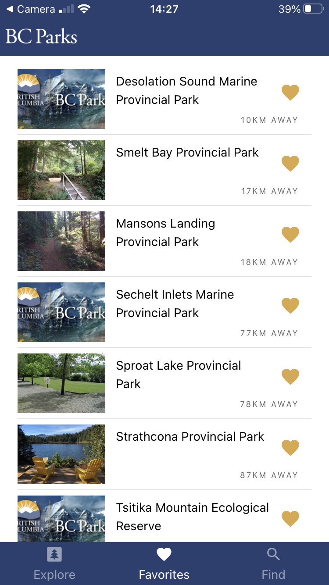
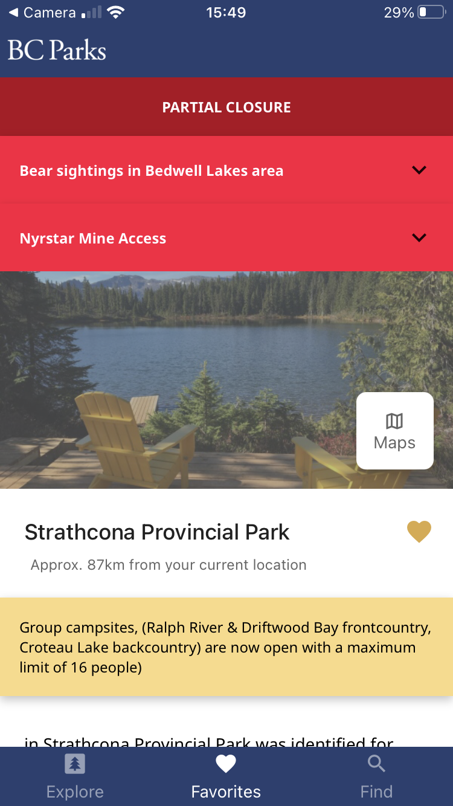
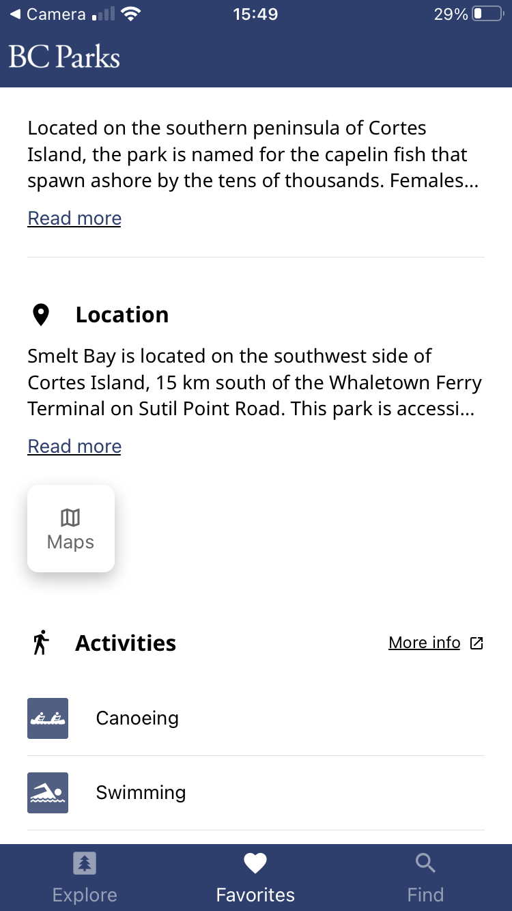
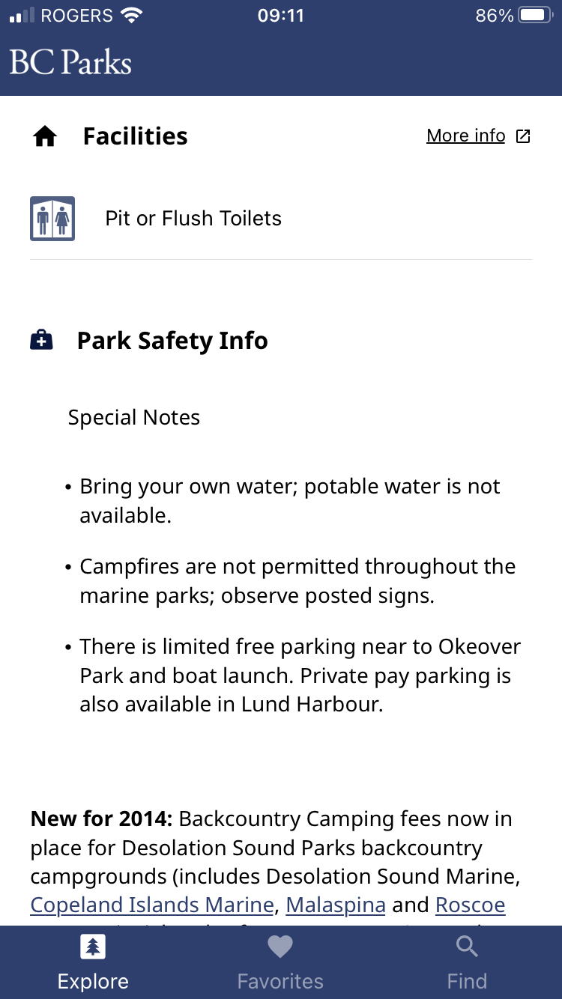
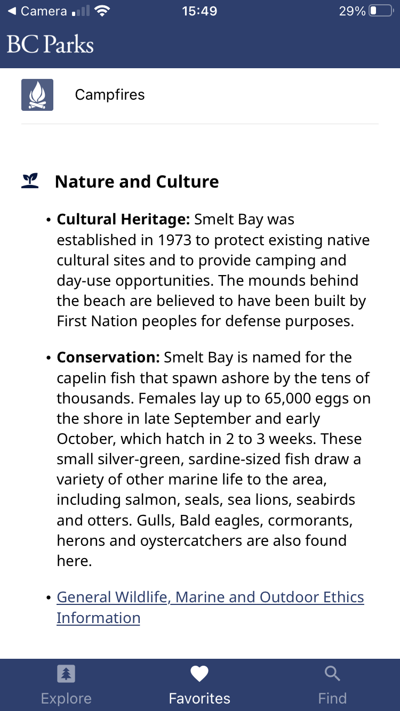

# Parks Adventure Mobile

Find and explore the wonders of **BC Parks**.

## Features

Two of the main screens, `Explore` and `Find`, provide different ways to
discover parks. Once a user finds a park they can find more information about
that park by navigating to the `Details` page. Then if that park is of interest
the `Favourites` page will help keep it close at hand. Users can also stay
up-to-date on the access status of parks (open, close, etc.) and any alert or
advisories they should be aware of before traveling.

---

### 1. Explore

<div style="display:flex;align-items:center;">
  <kbd></kbd>
  <p style="width: 400px;margin-left: 50px;">The <code>Explore</code> page shows
  users nearby parks which offer <strong>popular activities and facilities</strong>.</p>
</div>

---

### 2. Favourites

<div style="display:flex;align-items:center;">
  <kbd></kbd>
  <p style="width: 400px;margin-left: 50px;">The <code>Favourites</code> page
  allows users to <strong>keep the parks they are most interested in easily
  accessible</strong>.</p>
</div>

---

### 3. Find

<div style="display:flex;align-items:center;">
  <kbd></kbd>
  <kbd></kbd>
  <p style="width: 300px;margin-left: 50px;">The <code>Find</code> page allows
  users to <strong>search all of BCs parks</strong> based on a number of
  criteria, namely their <i>name</i>, <i>distance</i> from the user, their
  <i>activties</i>, and their <i>facilities</i>.</p>
</div>

---

### 4. Details

<div style="display:flex;align-items:center;">
  <kbd></kbd>
  <kbd></kbd>
  <p style="width: 400px;margin-left: 50px;">The <code>Details</code> page
  shows users <strong>information about each park</strong> such as a
  <i>description</i>, <i>location</i>, <i>activities</i>, <i>facilities</i>
  , <i>safety information</i>, and <i>nature and culture</i>.</p>
</div>
<kbd></kbd>
<kbd></kbd>

---

## Scripts

### Development

```bash
# Start or restart a local server for the app and get a URL/QR code to access
# the Expo Cli
npm start

# Open the app in the Expo Client on a connected Android device
npm run android

# Open the app in the Expo Client in an iOS simulator
npm run ios

# Run the automated tests (prettier, eslint, and jest)
npm test

# Verify ESLint rules are being met
npm run eslint

# Rewrite files using prettier rules
npm run prettier

# Verify Prettier rules are being met
npm run pretest

# Create Xcode and Android Studio projects for the app (to be used only if Expo
# becomes too restrictive).
npm run eject
```

### Building for testing or production

We are using React Native so that we can build this application for both iOS
and Android with a single data set. To create those bundles we must follow two
similar but slightly different workflows. For both operating systems we need
Expo to build us the appropriate bundles, an `.apk` file for Android and a
`.ipa` file for iOS. The following commands are used for that. We've created 4
different commands, two for each OS. One allows us to create a build under the
`Dev` release channel:

```bash
# Build a standalone IPA for your project, signed and ready for submission to
# the Apple App Store with release-channel set to "dev". It will be available
# via your expo dashboard.
yarn run build-dev-ios

# Build a standalone APK for your project, signed and ready for submission to
# the Google Play Store with release-channel set to "dev". It will be available
# via your expo dashboard.
npm run build-dev-android
```

and one allows us to creat a build under the `Prod` release channel:

```bash
# Build a standalone IPA for your project, signed and ready for submission to
# the Apple App Store with release-channel set to "prod". It will be available
# via your expo dashboard.
npm run build-prod-ios

# Build a standalone APK for your project, signed and ready for submission to
# the Google Play Store with release-channel set to "prod". It will be available
# via your expo dashboard.
npm run build-prod-android
```

Building for different release channels is primarily useful if you need
separate behaviour for testing and production which this app currently does not
require. Once you've followed the terminal steps it will print a url that can
be used to access the builds. It will look like `expo.io/builds/some-unique-id`.
From there, once the builds have finished, you can download both files. For iOS,
you can use [Transporter](https://apps.apple.com/us/app/transporter/id1450874784?mt=12)
to upload it to TestFlight. For Android the `.apk` file can be installed
directly onto Android devices. You can find more information on distributing
Android apps [here](https://developer.android.com/distribute/marketing-tools/alternative-distribution#email).
